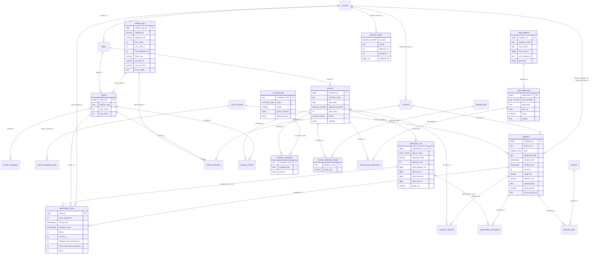

# ERD — Open T-Modeler product schema v1 (P01)

27 tables, 6 domains. Source of truth: `db/ddl/001_schema.sql`.

Conventions: identity bigint PKs + natural-key UNIQUE; audit (created/updated at/by) and effective_from/to + active_flag on masters; units mi / s / lb / cuft / USD (imperial, v2.0); ON DELETE CASCADE only for scenario and result children.
